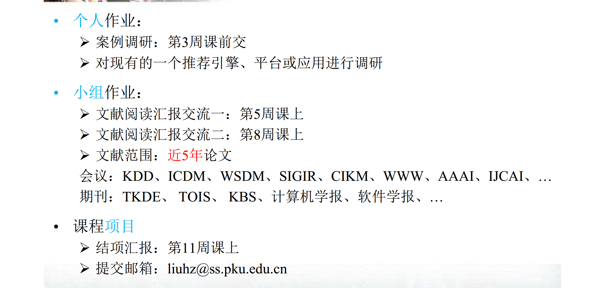

# 北京大学软件与微电子学院《推荐系统技术》课程作业

## 作业内容

----

## 任务安排

###  1.算法实现

>  说明：
>
>  a. 每组从下面的列表选一个算法，并在群里接龙以避免重复，例：“1. 张三 组 选算法3 WR-MF； 2. 李四组 选算法6 RSTE；...”；
>
>  b. **第5次课**前，提交两个版本的代码：
>
>  - （1）基于普通python3的版本（自己实线优化算法）；
>
>  - （2）基于TensorFlow的版本；
>
>  c. 做好算法设计，并给出设计文档，至少包含6个函数：（1）数据集的拆分（训练/验证/测试）；（2）数据加载；（3）模型训练（参数学习）；（4）模型（参数）保存；（5）模型（参数）加载；（6）模型测试或评估
>
>  d. 代码中应该有足够多的注释以便于阅读和理解。

贝叶斯个性化排序（BPR，Bayesian Personalized Ranking）

原始论文：[BPR: Bayesian Personalized Ranking from Implicit Feedback](https://arxiv.org/abs/1205.2618)

- BPR Python版  （3.16，第四周周六晚）：王胜广、
- BPR tensorflow版 （3.16，第四周周六晚）：王胜广、龚润宇
- BPR算法设计文档 （3.16，第四周周六晚）：

### 2.论文阅读
原始论文：[Wide & Deep Learning for Recommender Systems](https://arxiv.org/abs/1606.07792)

- Wide&Deep论文翻译 （3.16，第四周周六晚）：
- 论文算法实现  （3.23，第五周周六晚）：王胜广、
- 汇报PPT制作 （3.23，第五周周六晚）：
- 上台汇报（3.31，第六周周日课堂）：

### 3.课程项目

